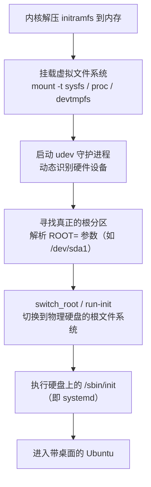

# 阶段一：initrd.img 学习与拆解

> [!info] 课设背景
> 环境：VMware 虚拟机 + Ubuntu 22.04 桌面版
> 目标：理解 initrd.img 的格式与执行流程，动手解压系统自带的 initrd.img 并分析其内部结构

---

## 1. initrd.img 的前世今生

### 1.1 Linux 2.4 内核：Initial RAM Disk（initrd）

| 项目 | 说明 |
|------|------|
| **机制** | 真正的**块设备映像**（Block Device Image），相当于一块虚拟物理硬盘，需要用 ext2 等文件系统格式化 |
| **执行入口** | 内核加载后执行 `/linuxrc` 脚本 |
| **缺点** | 被视为块设备 → 读写经过内核缓存（Page Cache）→ 内存中数据存在两份（ramdisk + Cache），浪费内存；大小固定，不够灵活 |

### 1.2 Linux 2.6+ 内核：initramfs（Initial RAM File System）

| 项目 | 说明 |
|------|------|
| **机制** | **cpio 归档文件**（通常使用 gzip / lz4 / zstd 压缩），直接解压到内存中作为 tmpfs/ramfs 挂载 |
| **执行入口** | 内核加载后执行根目录下的 `/init` 脚本（2.4 内核不识别此机制） |
| **优点** | 大小动态调整，用多少占多少；无需经过冗余的块设备缓存，内存利用率极高；制作简单，就是打包压缩 |

> [!tip] 现代 Ubuntu 22.04 实际使用的就是 initramfs 机制
> 只是为了历史兼容，文件名依然保留叫 `initrd.img`

### 1.3 对比总结

```
2.4 initrd:     磁盘镜像(ext2) → /linuxrc     → 固定大小 → 内存浪费
2.6 initramfs:  cpio归档+压缩  → /init         → 动态大小 → 内存高效
```

---

## 2. 动手实践：解压 Ubuntu 22.04 的 initrd.img

### 2.1 注意事项

现代 Ubuntu 的 `initrd.img` 实际上是**多段拼接**的结构：
- **前段**：不压缩的 CPU 微代码（early-microcode）
- **后段**：真正压缩的 cpio 主文件

> [!warning] 坑点
> 如果直接用传统的 `cpio` 解压，往往只能解出毫无用处的微代码部分而报错。需要使用 Ubuntu 专用的 `unmkinitramfs` 工具。

### 2.2 解压操作步骤

```bash
# 创建工作目录
cd ~
mkdir initrd_study
cd initrd_study

# 复制当前系统正在使用的 initrd.img
# $(uname -r) 会自动填入当前内核版本号
cp /boot/initrd.img-$(uname -r) ./my_initrd.img

# 使用 Ubuntu 专用工具解压多段式镜像
unmkinitramfs my_initrd.img ./extracted_files

# 查看解压后的目录结构
cd extracted_files
ls -l
```

### 2.3 解压结果

解压后可以看到类似以下的目录：

```
extracted_files/
├── early       # CPU 微代码（早期加载）
├── early2      # CPU 微代码（早期加载）
└── main/       # ★ 真正的系统初始化文件都在这里
    ├── init    # 核心启动脚本
    ├── bin/
    ├── sbin/
    ├── etc/
    ├── lib/
    ├── usr/
    └── ...
```

---

## 3. 分析 /init 脚本的执行流程

进入 `main` 目录查看 `/init` 脚本：

```bash
cd main
less init
```

### 3.1 关键执行过程

`/init` 脚本按顺序完成以下核心任务：



### 3.2 四个关键步骤详解

#### ① 挂载虚拟文件系统
```bash
mount -t sysfs sysfs /sys    # 让内核吐出硬件信息
mount -t proc proc /proc     # 提供进程和内核参数
mount -t devtmpfs devtmpfs /dev  # 设备节点
```

#### ② 启动 udev 守护进程
- 负责动态识别硬盘等硬件设备
- 根据硬件的 `MODALIAS`（硬件身份码）自动匹配并加载对应的 `.ko` 驱动

#### ③ 寻找真正的根分区
- 脚本中有一段很长的逻辑负责解析 `ROOT=` 参数
- 找到指定的硬盘分区（如 `/dev/sda1`）

#### ④ switch_root（切换根目录）
```bash
exec run-init    # 或 switch_root
```
- 清空当前临时文件系统占用的内存
- 将系统根目录**彻底切换**到真实的物理硬盘
- 启动硬盘上的 `/sbin/init`（systemd）

> [!note] run-init 的角色
> `run-init` 就是系统启动的"交接棒"：负责从临时内存系统"金蝉脱壳"，将控制权移交给物理硬盘上的真正操作系统。

---

## 4. Linux 启动全流程概览

```
BIOS/UEFI → GRUB引导加载器 → Linux内核（vmlinuz）
    → 解压 initrd.img 到内存（initramfs）
    → 执行 /init 脚本
        → 挂载虚拟文件系统（proc, sysfs, devtmpfs）
        → 启动 udev，加载驱动
        → 寻找并挂载真正的根分区
        → switch_root 切换到物理硬盘
    → 执行 /sbin/init（systemd）
    → 桌面环境
```

---

## 5. 关键概念速查表

| 概念 | 说明 |
|------|------|
| `initrd.img` | 初始内存磁盘映像，用于系统启动早期阶段 |
| `initramfs` | 2.6+ 内核使用的 cpio 归档格式，替代旧的 initrd |
| `/init` | initramfs 中的启动脚本入口（2.6+ 内核） |
| `/linuxrc` | 旧版 initrd 中的启动脚本入口（2.4 内核） |
| `cpio` | Unix 归档格式，用于打包 initramfs |
| `unmkinitramfs` | Ubuntu 专用工具，用于解压多段式 initrd.img |
| `switch_root` / `run-init` | 将根目录从内存切换到物理硬盘的命令 |
| `udev` | 动态设备管理守护进程，负责硬件识别和驱动加载 |
| `MODALIAS` | 内核为每个硬件生成的身份码，用于匹配驱动 |
| `vmlinuz` | 压缩的 Linux 内核镜像文件 |
